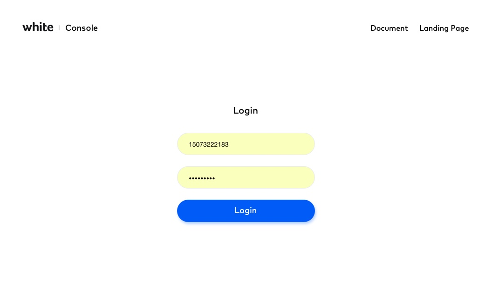
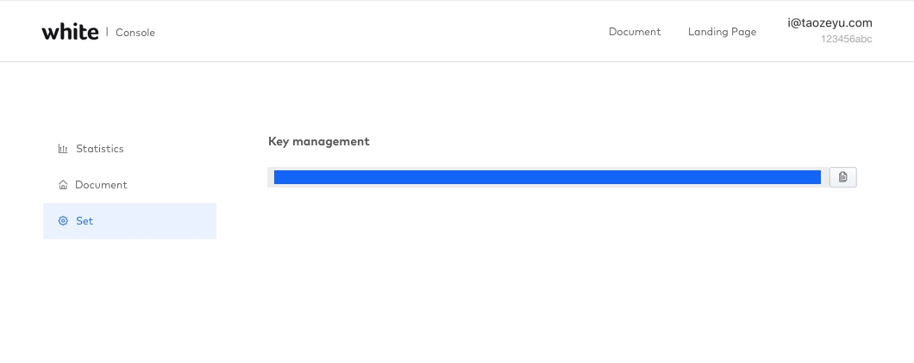

# Detailed concept

This chapter introduces the concepts of White, and understanding these concepts will help you use the features and services provided by White to help you develop more perfect websites and applications. Let's assume that you built your own first whiteboard application in the Quick Start chapter. If you haven't read the Quick Start section yet, it is highly recommended that you read this chapter after reading and practicing.

# Customer ID Mini Token

White also serves a wide range of clients, each of whom holds a unique Mini Token as a credential. Mini Token will be tied to your business account.

You can be at [console.herewhite.com](https://console.herewhite.com) register your own business account.

In Settings, you can get the Mini Token for your account.

__Note: Mini Token is the credential for White to communicate with your business server. Do not leak in any form.__

You __should not__ write the Mini Token to the client/web page code because someone else might get the Mini Token by decompiling your client code. Any public API of the business server should not return a Mini Token in case someone else gets the Mini Token by forging the client. Don't post the Mini Token directly on the website or pass it to the outside world via IM or email.

You __should__ Write the Mini Token to the code of the business server, or to the configuration file of the server. Mini Token is safe as long as you can ensure that the server's code and configuration files are not available to the outside world.

# room

The core of White's service is the room. One whiteboard corresponds to one room, and one room can join multiple clients. Your business server uses Mini Token to create a room, and White's server will return `uuid` and `roomToken` for that room.

## uuid

The unique identifier of the room is a string. It can be used to locate the room. This is a very important property of the room, and it is used for all API calls related to the room.

## Room Token

Every room has its own `roomToken`, and the `roomToken` in different rooms is different. The client can only enter if it has a `roomToken` for a specific room.

The business server can use it to achieve authentication. The specific approach is to first determine through the business logic whether the client is eligible to enter a specific room. If eligible, pass the room's `roomToken` to the client over the network. The client gets `roomToken` and calls its own client SDK to enter the room.

Since `roomToken` must be obtained with Mini Token, the client cannot forge `roomToken`.

# Timing diagram

