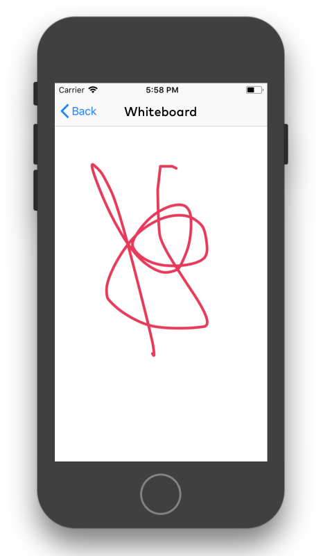

# iOS quick start

Hi, Dear developer, welcome to the Whiteboard. This tutorial will guide you through the introduction of an interactive whiteboard in your iOS project. But first, let's assume that you already know the underlying syntax of Objective-C.

# Start preparing

* Download [Xcode](https://itunes.apple.com/cn/app/xcode/id497799835?ls=1&mt=12) and configure the iOS development environment.

# Add dependency

* First of all, you need to refer to [iOS SDK install](iOS_SDK_install.md), in the Podfile, add the dependency of White-iOS-SDK. Install White-iOS-SDK with `pod install`.


# Introduce white-sdk related header files

* In the ViewController instance that needs to add a whiteboard, the white file file WhiteSDK.h of White-iOS-SDK is introduced.

```objectivec
#import <White-SDK-iOS/WhiteSDK.h>

@interface ViewController ()
// Need to hold a WhiteRoom instance and perform various operations on the whiteboard
@property (nonatomic, strong) WhiteRoom *room;
@property (nonatomic, strong) WhiteSDK *sdk;
@property (nonatomic, strong) WhiteBoardView *boardView;
@end
```

# Create a whiteboard using the SDK

## 1. Get permission

First, we need to get the `RoomUUID` & `RoomToken` for the room.

There are two situations:

- 1. Create a brand new room: Create a new room via openAPI, get `RoomUUID` & `RoomToken` and then join the room.
- 2. Enter an existing room: There is `RoomUUID`, and the corresponding `RoomToken` is obtained through openAPI.

In the demo, we are only considering creating a room for the time being.

To ensure safety, we recommend you to refer to [Best Practices](concept.md), get `RoomToken` through the backend.

In Demo, we are using the iOS official API to request OpenAPI to get `RoomUUID` and `RoomToken`.

```objectivec
- (void)creatNewRoomRequestWithResult:(void (^) (BOOL success, id response))result;
{
    // self.token For the string, the specific acquisition, please refer to https://developer.herewhite.com/#/concept
    NSURLRequest *request = [NSURLRequest requestWithURL:[NSURL URLWithString:[NSString stringWithFormat:@"https://cloudcapiv3.herewhite.com/room?token=%@", self.sdkToken]]];
    NSMutableURLRequest *modifyRequest = [request mutableCopy];
    [modifyRequest setHTTPMethod:@"POST"];
    [modifyRequest addValue:@"application/json" forHTTPHeaderField:@"Content-Type"];
    [modifyRequest addValue:@"application/json" forHTTPHeaderField:@"Accept"];
    // In the post request, the room name can be set, and the number of people can be limited.
    NSDictionary *params = @{@"name": @"test", @"limit": @110};
    NSData *postData = [NSJSONSerialization dataWithJSONObject:params options:0 error:nil];
    [modifyRequest setHTTPBody:postData];
    
    NSURLSessionTask *task = [[NSURLSession sharedSession] dataTaskWithRequest:modifyRequest completionHandler:^(NSData * _Nullable data, NSURLResponse * _Nullable response, NSError * _Nullable error) {
        dispatch_async(dispatch_get_main_queue(), ^{
            if (error && result) {
                result(NO, nil);
            } else if (result) {
                NSDictionary *responseObject = [NSJSONSerialization JSONObjectWithData:data options:0 error:nil];
                result(YES, responseObject);
            }
        });
    }];
    [task resume];
}
```

## 2. Create an instance

Create `WhiteBoardView` and `WhiteSDK`, and create the instance classes required by sdk in `ViewDidLoad`.

```objectivec
- (void)viewDidLoad {
    [super viewDidLoad];
    WhiteBoardView *boardView = [[WhiteBoardView alloc] init];
    // Is the configuration item of the whiteboard, mainly used to specify the maximum zoom ratio, you can use defaultConfig directly (maximum 1000%, minimum 10%)
    WhiteSDK *sdk = [[WhiteSDK alloc] initWithWhiteBoardView:self.boardView config:[WhiteSdkConfiguration defaultConfig]];
    // Here we recommend creating properties that hold WhiteBoardView and WhiteSDK.
    self.boardView = boardView;
    self.sdk = sdk;
}
```

## 3. Join the whiteboard

In ViewDidLoad, call the `creatNewRoomRequestWithResult:` method to get the `RoomUUID` and `RoomToken` APIs. Join and connect to the whiteboard in the callback by calling WhiteSDK joinRoomWithRoomUuid.

```objectivec
- (void)viewDidLoad {
    [super viewDidLoad];

    WhiteBoardView *boardView = [[WhiteBoardView alloc] init];
    self.boardView = boardView;
    // Note: In the case of iOS 12 real machine, WhiteBoardView needs to be added to the view stack before WhiteSDK can run normally.
    self.boardView.frame = self.view.bounds;
    self.boardView.autoresizingMask = UIViewAutoresizingFlexibleWidth |  UIViewAutoresizingFlexibleHeight;
    [self.view addSubview:self.boardView];

    WhiteSDK *sdk = [[WhiteSDK alloc] initWithWhiteBoardView:self.boardView config:[WhiteSdkConfiguration defaultConfig]];
    self.sdk = sdk;
    // Current step, add code
    [self creatNewRoomRequestWithResult:^(BOOL success, id response) {
        if (success) {
            // RoomToken, and UUID acquisition, depending on the return structure of your background server, the acquisition method will be different.
            NSString *roomToken = response[@"msg"][@"roomToken"];
            NSString *uuid = response[@"msg"][@"room"][@"uuid"];
            [self.sdk joinRoomWithRoomUuid:uuid roomToken:roomToken callbacks:(id<WhiteRoomCallbackDelegate>)self completionHandler:^(BOOL success, WhiteRoom *room, NSError *error) {
                if (success) {
                    self.title = NSLocalizedString(@"My whiteboard", nil);
                    // Here we use the property to hold WhiteRoom
                    self.room = room;
                } else {
                    self.title = NSLocalizedString(@"Join failed", nil);
                    // TODO: error
                }
            }];
        } else {
            // Get RoomToken, and RoomUUID failed
        }
    }];
}

```

# Experience whiteboard
 
Ok, here, wait for the top navigation bar to change to "My Whiteboard". At this time, we have successfully added a whiteboard application. In the simulator, in the simulation, hold down the mouse and smudge it to see the strokes.



# Demo code acquisition

- [white-iOS-Demo](https://github.com/duty-os/white-demo-ios) 

